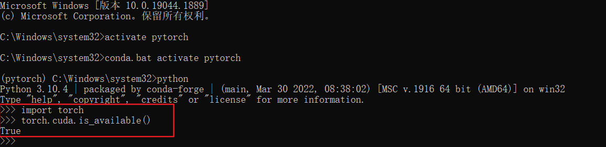
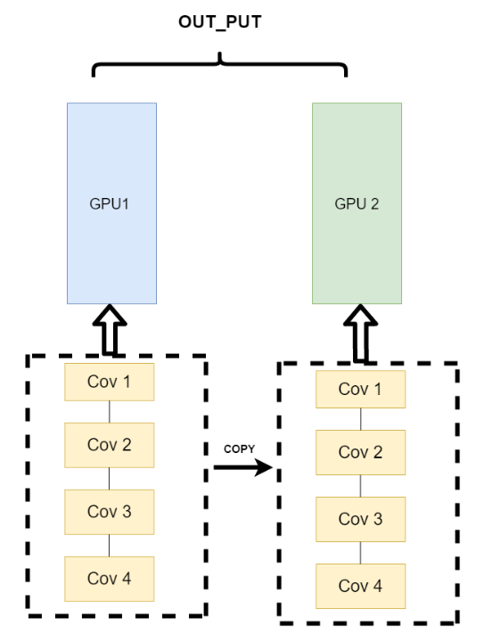

# chapter1 pytorch的简介、安装和学习资源

## 1.1 简介

PyTorch是由Facebook人工智能研究小组开发的一种基于Lua编写的Torch库的Python实现的深度学习库，目前被广泛应用于学术界和工业界，是当前难得的简洁优雅且高效快速的框架，甚至已经超过了google的tenserflow框架。

### 优势

- **更加简洁**，相比于其他的框架，PyTorch的框架更加简洁，易于理解。PyTorch的设计追求最少的封装，避免重复造轮子。
- **上手快**，掌握numpy和基本的深度学习知识就可以上手。
- PyTorch有着**良好的文档和社区支持**，作者亲自维护的论坛供用户交流和求教问题。Facebook 人工智能研究院对PyTorch提供了强力支持，作为当今排名前三的深度学习研究机构，FAIR的支持足以确保PyTorch获得持续的开发更新。
- **项目开源**，在Github上有越来越多的开源代码是使用PyTorch进行开发。
- 可以**更好的调试代码**，PyTorch可以让我们逐行执行我们的脚本。这就像调试NumPy一样 – 我们可以轻松访问代码中的所有对象，并且可以使用打印语句（或其他标准的Python调试）来查看方法失败的位置。
- 越来越完善的扩展库，活力旺盛，正处在**当打之年**。

## 1.2 安装



我事先已安装好了。

## 1.3 学习资源

1. [Awesome-pytorch-list](https://github.com/bharathgs/Awesome-pytorch-list)：目前已获12K Star，包含了NLP,CV,常见库，论文实现以及Pytorch的其他项目。
2. [PyTorch官方文档](https://pytorch.org/docs/stable/index.html)：官方发布的文档，十分丰富。
3. [Pytorch-handbook](https://github.com/zergtant/pytorch-handbook)：GitHub上已经收获14.8K，pytorch手中书。
4. [PyTorch官方社区](https://discuss.pytorch.org/)：PyTorch拥有一个活跃的社区，在这里你可以和开发pytorch的人们进行交流。
5. [PyTorch官方tutorials](https://pytorch.org/tutorials/)：官方编写的tutorials，可以结合colab边动手边学习
6. [动手学深度学习](https://zh.d2l.ai/)：动手学深度学习是由李沐老师主讲的一门深度学习入门课，拥有成熟的书籍资源和课程资源，在B站，Youtube均有回放。
7. [Awesome-PyTorch-Chinese](https://github.com/INTERMT/Awesome-PyTorch-Chinese)：常见的中文优质PyTorch资源

# chapter2 pytorch基础知识

## 2.1 张量

### 数组维度

- 一维:向量
- 二维：矩阵
- 三维：图像：width height channel
- 四维：数量多的图像:width height channel batch
- 五维：视频：加上时间的维度

### 张量创建

```
x=torch.arange(12)
x=torch.tensor([[[1,2,3],[4,5,6],[7,8,9]]])
```

#### 零向量

```
torch.zeros((2,3,4))
```

#### 全一向量

```
torch.ones((2,3,4))
```

#### 均值为0，标准差为1的标准高斯分布（正太分布）

```
torch.randn((3,4))
```

### 张量之间的基本运算

```
x=torch.tensor([1,2,3,4,5])
y=torch.tensor([2,2,2,2,2])

x+y,x-y,x*y,x/y,x**y
```

#### 幂运算

```
torch.exp(x)
```

#### 求和

```
x.sum()
```

### 张量合并

```
torch.cat((x,y),dim=0) 
torch.cat((x,y),dim=1)
```

### 广播机制

#### 规则

广播机制触发是需要两个条件的，第一个是两个张量必须不为空，第二个是两个张量从右向左一次比较，要么相同，要么其中一个为1，要么其中一个为空。

#### 例子：

```
a = torch.arange(3).reshape((3,1))
b = torch.arange(2).reshape((1,2))
a+b
```

输出：

```
tensor([[0, 1],
        [1, 2],
        [2, 3]])
```

### 节省内存操作

```
#原地操作
z = torch.zeros_like(y)
print(id(z))
z[:]=x+y
id(z)
```

如果在后续计算中没有重复使用a,我们可以使用a[:]=a+b或a+=b来减少操作的内存开销。

```
before=id(a)
a[:]=a+b
id(a)==before
```

### 张量与numpy之间的转换

```
a,a.numpy(),torch.tensor(a.numpy()),type(a),type(a.numpy()),type(torch.tensor(a.numpy()))
```

## 2.2 自动求导

### 用法：

```
import torch

x = torch.arange(4.0)
x
```

输出：

```
tensor([0., 1., 2., 3.])
```

将requires_grad设置为True

```
x.requires_grad_(True)  # 等价于x=torch.arange(4.0,requires_grad=True)
x.grad  # 默认值是None
```

```
y = 2 * torch.dot(x, x)
y
```

输出：

```
tensor(28., grad_fn=<MulBackward0>)
```

自动计算梯度

```
y.backward()
x.grad
```

输出：

```
tensor([ 0.,  4.,  8., 12.])
```

等价于：

```
x.grad == 4 * x
```

输出：

```
tensor([True, True, True, True])
```

在默认情况下，PyTorch会累积梯度，我们需要清除之前的值

```
x.grad.zero_()
```

### 非标量变量的反向传播（非标量：即向量和矩阵）

```
# 对非标量调用backward需要传入一个gradient参数，该参数指定微分函数关于self的梯度。
x.grad.zero_()
y = x * x
y.sum().backward()
x.grad
```

输出：

```
tensor([0., 2., 4., 6.])
```

### 分离计算

将某些计算移动到记录的计算图之外

```
x.grad.zero_()
y=x*x
u=y.detach() #此时相当于u变为了常数，与x无关
z=u*x

z.sum().backward()
x.grad==u
```

输出：

```
tensor([True, True, True, True])
```

### 在python控制流中使用梯度

```
def f(a):
    b = a * 2
    while b.norm() < 1000:
        b = b * 2
    if b.sum() > 0:
        c = b
    else:
        c = 100 * b
    return c

a = torch.randn(size=(), requires_grad=True)
d = f(a)
d.backward()

d/a==a.grad
```

输出：

```
tensor(True)
```

## 2.3 并行计算（了解）

### 由来

深度学习的发展离不开算力的发展，GPU的出现让我们的模型可以训练的更快，更好。所以，如何充分利用GPU的性能来提高我们模型学习的效果，这一技能是我们必须要学习的。这一节，我们主要讲的就是PyTorch的并行计算。PyTorch可以在编写完模型之后，让多个GPU来参与训练，减少训练时间。

### 常用方法

- 网络结构分布到不同的设备中(Network partitioning)

- 同一层的任务分布到不同数据中(Layer-wise partitioning)

- 不同的数据分布到不同的设备中，执行相同的任务(Data parallelism)

目前主流方式是第三种。

### 主要逻辑

我不再拆分模型，我训练的时候模型都是一整个模型。但是我将输入的数据拆分。所谓的拆分数据就是，同一个模型在不同GPU中训练一部分数据，然后再分别计算一部分数据之后，只需要将输出的数据做一个汇总，然后再反传。

架构图：


